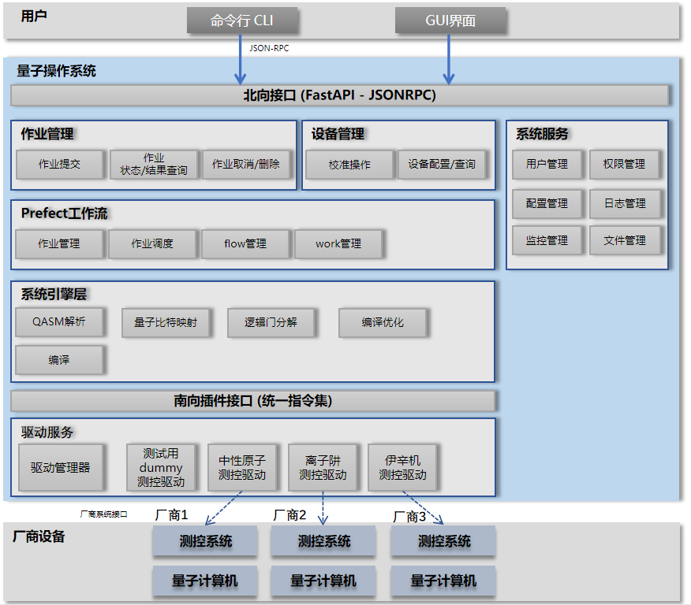

# QCOS介绍

QCOS（Quantum Computing Operating System）是一款开源的通用量子计算操作系统，旨在为不同架构的量子计算机（如中性原子、相干伊辛机等）提供统一的软件支持，推动量子计算的生态发展。

# 一、架构总览

# 二、功能特性

|      |                  功能             |
|:-----|:-------------------------------:|
| 交互方式 |               命令行、API           |
| 系统服务 | 配置管理、日志管理、用户管理（规划）、权限管理（规划）、监控管理（规划） |
| 设备管理 |         校准操作（规划）、设备配置/查询（规划）    |
| 作业管理 |      作业提交、取消（开发中）、删除、状态查询、结果查询  |
| 系统引擎 |       QASM解析、逻辑门分解、量子比特映射、编译优化  |
| 驱动插件 |   dummy测试驱动、中科酷原中性原子、玻色量子伊辛机    |

# 三、安装使用

官方已适配操作系统：BCLinux 21.10U4

## 快速上手

参考：[快速使用指南](INSTALL.md)

# 四、许可证

QCOS开源代码遵循[MulanPSL-2.0](LICENSE)开源协议。
