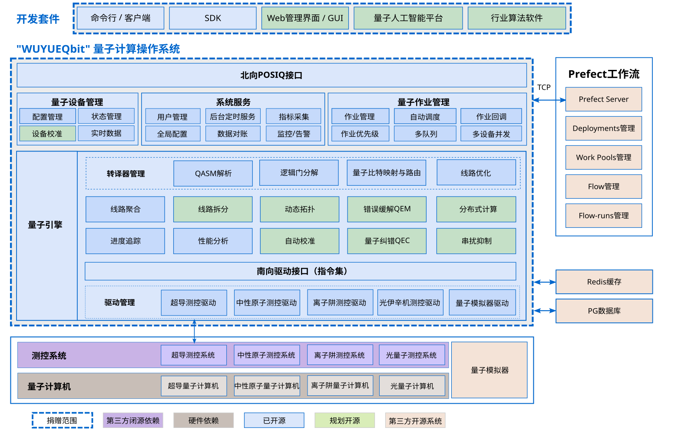

架构概述
===========

整个量子操作系统分为多个部分，包括用户界面(命令行和Web界面)、北向API、作业管理、设备管理、调度策略、系统服务、工作流管理、系统引擎、驱动和驱动管理等模块。

* 用户界面：提供用户输入，包括命令行和Web界面。
* 北向API：操作系统和用户界面之间的接口。
* 作业管理：提供作业的提交、作业列表查询、作业结果和状态的查询、作业取消和作业删除。
* 工作流管理：提供作业的工作池、并发管理、优先级调度等能力。
* 设备管理：提供设备通用的配置和查询，以及设备校准等维护性和调试性操作。
* 调度策略：提供Flavor预设策略、Device Group设备分组、自动调度（Filter+Weigher模式）、
  extra_specs动态约束（设备白名单/黑名单、技术类型、可用率阈值等）。
* 系统服务：提供用户管理、权限管理、配置查询、监控告警、热升级等。
* 系统引擎：提供量子相关的QASM文件输入解析、转译、量子比特映射、逻辑门分解、优化等。
* 驱动和驱动管理：提供不同量子计算机的驱动，以及驱动的自动发现、配置加载等能力。

   量子计算操作系统(QCOS)架构图
