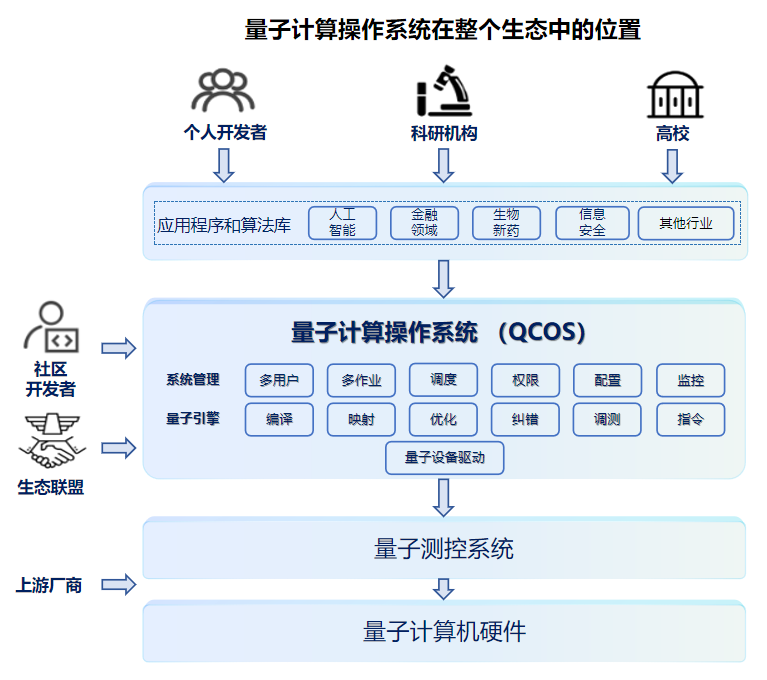

概述
===========

量子计算机的意义和发展
----------------------------
量子计算作为一项具有革命性意义的技术，与传统计算技术存在本质差异，量子计算机以量子比特为核心，借助量子叠加（比特同时处于多状态）与量子纠缠（比特间超距关联）特性，突破经典计算机二进制限制，实现复杂问题的并行计算。
依托这些量子物理的特性，量子计算机深刻地影响了密码学、材料科学、医药科学等关键领域，可破解各类复杂难题，如大数分解问题、量子模拟（如分子建模）问题、优化问题等，弥补经典计算机处理大规模问题时的算力不足。

量子计算机发展始于1982年费曼提出量子模拟概念，1985年大卫・多伊奇建立量子图灵机模型，1994年Shor算法推动其受广泛关注。
当前，各国在超导、光量子等领域积极研发，IBM、谷歌、中国科大等取得重要成果，量子计算机正从实验室走向实用化。

量子计算机架构现状和问题
----------------------------
当前，国内外量子计算机厂商所采用的系统设计模式大多为自研的封闭、独立的软 / 硬一体化模式。
在这种模式下，其核心组件包含了量子硬件、测控组件，以及硬件管理与调试模块等；而功能方面，则涵盖了量子编译映射优化、纠错、校准、作业下发以及调度管理等内容。

不可否认，这样的设计模式确实能够满足基础功能方面的需求，并且有着简单易用、便于快速落地以及利于调试等优势。然而，从产业长远发展的角度去深入考量，便会发现它在技术兼容性以及未来扩展性方面存在着较为显著的短板。
这种短板极易催生出技术壁垒，导致形成路径依赖，不仅会拖慢量子计算朝着实用化、产业化转型的步伐，更会阻碍构建开放协同的量子产业生态体系。

量子计算操作系统的作用和架构
----------------------------

作用和意义
***************
回顾上世纪经典计算机的发展历程，不难发现，在经典计算机系统中，除了CPU、内存等硬件设备以及应用软件之外，操作系统随之诞生。
操作系统诞生的初衷，主要是为了提升硬件利用率、协调资源分配、管理外部设备，同时实现多用户交互以及简化操作等，从实际效果来看，它有力地推动了计算机的普及，极大地降低了使用门槛，并且很好地满足了人们多样化的使用需求。
如今，主流的计算机操作系统有UNIX、Linux、Windows、MacOS等等。从系统的组成来看，操作系统涵盖了硬件资源管理、进程资源管理调度、程序编译运行、以及命令行或图形界面等交互接口。

事实上，量子计算机系统确实应当具备经典计算机操作系统所拥有的各类能力。
当下，量子计算机厂商多采用封闭式设计，由此产生了诸多问题，而量子计算机系统若要打破这一现状，采用开放的分层解耦方式便显得尤为重要。
通过分层解耦，系统各层的功能会更加聚焦且明确，操作流程也会随之变得更为简便易行。更为关键的是，各层之间借助标准接口能够达成高效的交互，这为整个系统的协同运作奠定了良好基础。

具体来看，对于开发者群体而言，量子计算操作系统有着极大的优势。
它能够巧妙地屏蔽不同硬件之间存在的差异，如此一来，开发者便无需在硬件适配等方面耗费过多精力，可以将全部心思聚焦于算法创新这一关键环节上，从而更有利于推动量子计算在算法层面的发展与突破。
而站在硬件厂商的角度，量子计算操作系统同样意义非凡。
它会制定统一的驱动标准，并且运用编译优化、错误缓解、任务聚合、并行复用等一系列先进技术，帮助硬件厂商充分挖掘硬件潜力，有效提升硬件的效能，进而助力硬件产品在性能方面实现质的飞跃，更好地适配量子计算系统的整体运行需求。

系统架构
***************
分层解耦后的量子计算机系统，主要划分为量子应用程序、量子计算操作系统、量子测控系统、量子计算硬件四大层级。
其中，量子计算操作系统重点承担多用户管理、多任务处理、系统整体管控及量子引擎运行等核心职责。
而量子引擎的核心能力包括量子编译映射优化、量子比特校准、量子指令和时序的分发、量子计算结果的获取与纠错等能力。

   量子计算操作系统在整个生态中所处的位置

编译和优化
***************
在量子计算的技术体系中，量子引擎里的编译映射优化堪称量子计算操作系统的一项关键技术。
它肩负着重要使命，能够把各类量子应用程序对应的量子线路精准无误地映射至物理量子比特之上，并且在此基础上，借助线路优化的手段，有效削减噪声干扰，进而显著提升量子计算的准确度，为量子计算结果的高质量输出筑牢基础。

错误处理技术
***************
与此同时，量子纠错技术同样在量子计算里扮演着不可或缺的角色。
它依靠特定的编码方式以及精心设计的操作策略，在量子比特执行任务的过程中，时刻保持敏锐的“洞察力”，实时检测并精准纠正可能产生的误差，宛如为量子计算披上了一层坚实的“防护甲”，有力地保障了量子计算的精度与可靠性。

就当前的量子计算发展阶段而言，正处于`含噪声中等规模量子时代（NISQ - Noisy Intermediate-Scale Quantum Era）`，面临着诸多棘手难题。
其中，最为核心的挑战便是硬件、环境噪声以及各种错误等因素相互交织，共同作用，进而导致了计算稳定性和量子态保真度方面出现了一系列问题，严重影响着量子计算结果的稳定性和准确性，亟待解决。

以下是量子计算操作系统为提高量子计算结果的稳定性和准确性所采取的几方面应对措施：

- 量子误差缓解（`QEM - Quantum Error Mitigation`）：错误缓解属于一种后处理方法，借助软件来补偿计算过程中产生的噪声。
  其基本思路是通过经典模拟对少量量子比特的计算结果进行验证，从而在一定可信度基础上，缓解更大系统中的错误。
  具体而言，通用的错误缓解方法主要有：`测量误差缓解（MEM）`、`零噪声外推（ZNE）`和`概率误差消除（PEC）`。
  - 测量误差缓解（MEM）：减轻量子比特测量过程中的噪声（如读取错误导致的结果翻转）。
  通过预先校准测量设备，生成“测量误差矩阵”，再用该矩阵对实际测量结果进行反向修正，消除测量噪声的影响。
  - 噪声外推（ZNE）：是一种运用噪声缩放技术来预估理想无噪声情况下期望值的方法。
  它先是在不同强度的噪声环境下运行同一个量子电路，并对其输出结果进行测量。
  随后，利用插值或外推方法对这些结果予以拟合，进而推断出零噪声极限下的结果。
  该方法基于噪声强度与电路深度成正比这一假设。
  - 概率误差消除（PEC）：是一种利用误差幅增技术来重构理想无误差情况下期望值的方法。
  它首先依据已知的误差模型，把目标电路分解为一组无误差电路以及相应的概率权重。
  接着，在硬件上运行这些无误差电路，并依据其测量结果和概率权重进行加权平均，最终得到目标电路的结果。
  此方法建立在误差模型准确这一假设之上。
- 量子纠错（`QEC - Quantum Error Correction`）：借鉴经典纠错码思想，通过编码把少量的量子比特信息冗余编码到多个量子比特组成的量子态中，
  在错误发生后及时进行纠错，降低错误率。常见的纠错算法有Shor码、表面码、拓扑码等等。
- 噪声感知的编译优化：通过优化量子线路编译过程，减少量子线路深度、量子门操作次数和量子比特间的串扰，并从量子比特初始映射和连接拓扑层面进行优化，提升计算稳定性。
- 设备校准与控制‌：周期性校准设备参数，提升量子门保真度。

设备兼容性
***************
除此之外，量子计算操作系统还展现出了独特且重要的作用，其能够显著增强量子应用程序在不同量子计算机底层架构之间的兼容性与可移植性，
成功打破长久以来横亘在其间的技术壁垒，为量子计算在更广泛的硬件平台上的应用创造了有利条件。

核心目标
***************
不仅如此，量子计算操作系统还有着清晰明确的十大核心目标，这些目标从多个维度勾勒出了其功能与作用：

- 具备高效的量子作业管理与调度能力
- 支持多用户并行操作，兼容多作业同时运行与多后端设备接入
- 实现量子线路的运行时解析、转译与优化，并能将其转化为底层设备可识别的指令
- 完成量子后端设备（含测控系统与量子芯片）的抽象化处理、全生命周期管理，以及指令下发、校准与调测等操作
- 实时处理量子计算过程中的错误与噪声，结合纠错算法提升系统可用性
- 最大化挖掘量子硬件性能，提升整体计算效率与硬件利用率，缩短作业耗时
- 支持可插拔的插件与驱动模型，通过抽象底层接口，兼容不同类型的量子计算机与模拟器
- 提供核心模块的性能检查与基准测评功能，精准定位系统性能瓶颈
- 配备标准的北向API、命令行工具及Web管理界面，方便用户操作与自动化流程
- 将AI技术融入量子比特校准、量子比特纠错等关键领域，提升系统智能化水平

总结
***************
总而言之，量子计算作为颠覆性的革命性技术，其技术实用化与产业化转型进程的加速，离不开全产业链更多厂商、科研人员及开发者的深度参与。
而量子计算操作系统在整个量子生态中起着承上启下的关键作用，是推动量子生态繁荣的核心支撑。
它通过分层解耦打破当前产业的封闭壁垒，依托十大核心目标的落地实现，有效解决技术稳定性、准确性、兼容性、可移植、系统扩展性等关键问题，
最终为量子产业生态构建与核心技术转化，发挥不可替代的关键价值，进而共同推动量子产业生态体系朝着繁荣发展的方向迈进。
