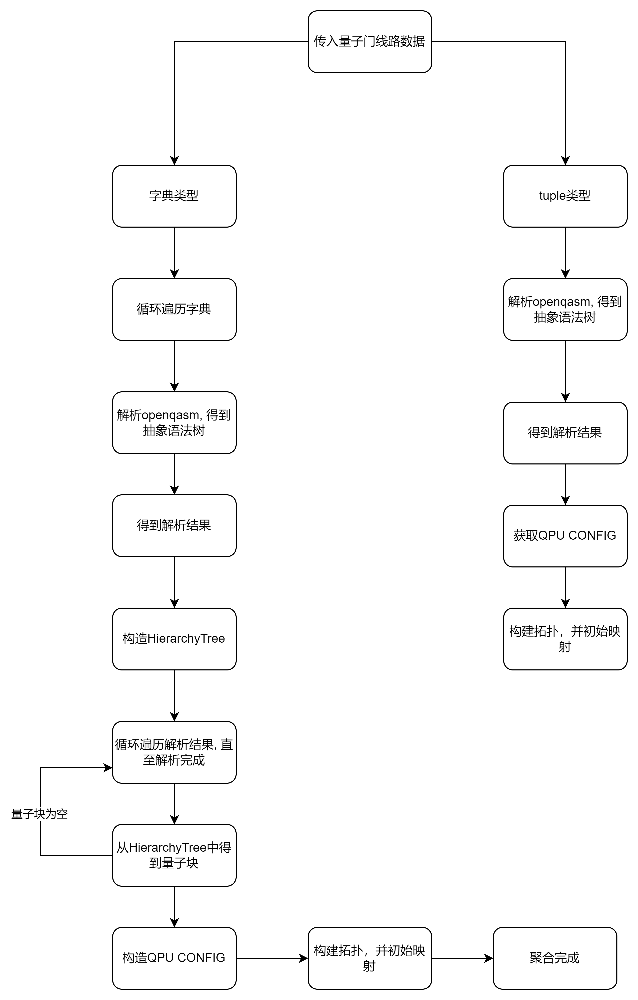
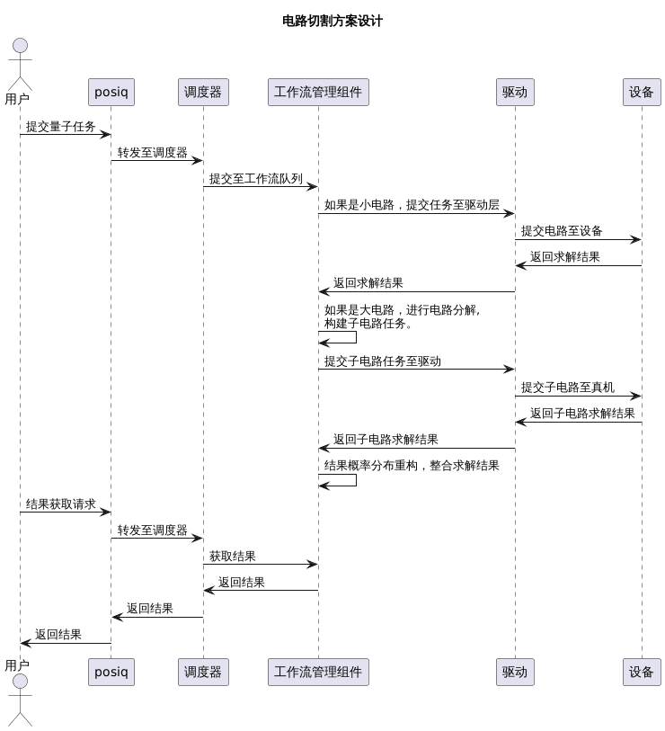
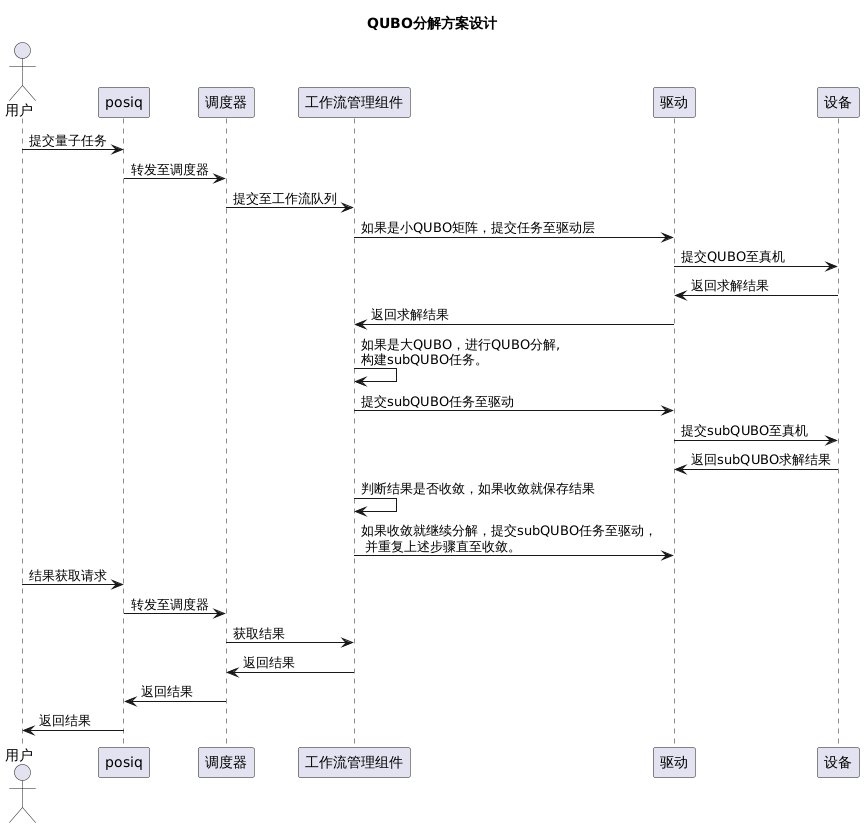

聚合与拆分
===================

本章节主要介绍了量子线路聚合与拆分、QUBO分解的设计。

量子线路聚合
--------------------
量子线路聚合的功能是将多个量子线路聚合成一个量子线路，将聚合后的量子线路转译成基础门列表发送给Driver。

(1)关键数据结构

.. code-block:: shell

    class SourceCodeInfo:
        aggregation_type: Optional[str] = None
        aggregated_code_list: Optional[List[Dict]] = None
        aggregated_result_list: Optional[List[Dict]] = None
        seperated_code_map: Optional[Dict] = None
        seperated_result_map: Optional[Dict] = None

| aggregation_type: 聚合类型，其取值范围为None, internal, external。分别代表着聚合关闭，任务内聚合，任务间聚合。
| aggregated_code_list: 如果打开了任务内聚合或者任务间聚合，则将尝试聚合的量子线路放入此数据结构中。
| aggregated_result_list: 聚合结果列表。
| seperated_code_map: 如果没有打开任务聚合，则将量子线路放入此数据结构中。
| seperated_result_map:未聚合的量子线路执行结果。

(2)总体流程图

量子线路拆分
--------------------

量子线路拆分目的是解决通用量子计算机受限于量子比特数量，无法直接求解大电路问题而设计的。
支持将用户提交的大电路任务分解为量子计算机能够支持最大比特规模的一系列子电路任务，
经过量子计算机求解后重构为大电路的执行结果。

大电路任务通过电路拆分再求解的具体流程：

|   1、任务提交：用户提交电路任务，系统构建相应的作业流（job_flow）
|   2、规模判定：工作流管理组件电路大小
|   (1)若电路比特未超限（满足设备比特要求）：直接向设备提交任务求解，直接跳转步骤6
|   (2)若电路比特超限：进入电路分解流程
|   3、电路分解：工作流管理组件先将电路转为DAG图，然后进行电路切割
|   4、子电路求解：将子电路任务提交至设备求解
|   5、概率分布重构：合并所有子电路的结果，进行概率分布重构
|   6、结果返回：流程终止后，用户通过原作业ID(job_id)从结果接口获取最终概率分布结果。

电路切割时序图：

QUBO分解
--------------------

QUBO拆分（也称QUBO分解）目的是解决伊辛机受限于量子比特数量，无法直接求解大QUBO问题而设计的。
支持将用户提交的大QUBO任务分解为伊辛机能够支持最大比特规模的子QUBO任务，
并基于QUBO分解算法进行解的合并于重构，结合优化更新算法最终获取最优解。

大QUBO任务通过QUBO分解算法求解问题的具体流程：

|   1、任务提交：用户提交QUBO的量子任务，系统构建相应的作业流（job_flow）
|   2、规模判定：工作流管理组件校验QUBO问题规模
|   （1）若规模未超限（满足伊辛机比特要求）：直接向设备提交任务求解，跳转步骤7
|   （2）若规模超限：进入大QUBO分解流程
|   3、QUBO分解：工作流管理组件调用QUBO分解算法，将原问题分解为符合伊辛机比特数限制的子QUBO问题（subQUBO）
|   4、子任务求解：将subQUBO任务提交至伊辛机进行求解，并收集返回的中间解
|   5、解合并与重构：工作流管理组件基于分解规则，将subQUBO求解的解合并，重构出原大规模QUBO的一个候选完整解
|   6、收敛性判断：根据预设的优化更新算法判断解是否收敛：
|   （1）若未收敛：流程结束进入步骤7
|   （2）若收敛：以当前解为新的起点，返回步骤3，启动新一轮分解与求解，进行迭代优化。
|   7、结果返回：流程终止后，用户通过原作业ID(job_id)从结果接口获取最终求解结果。

QUBO分解时序图：

