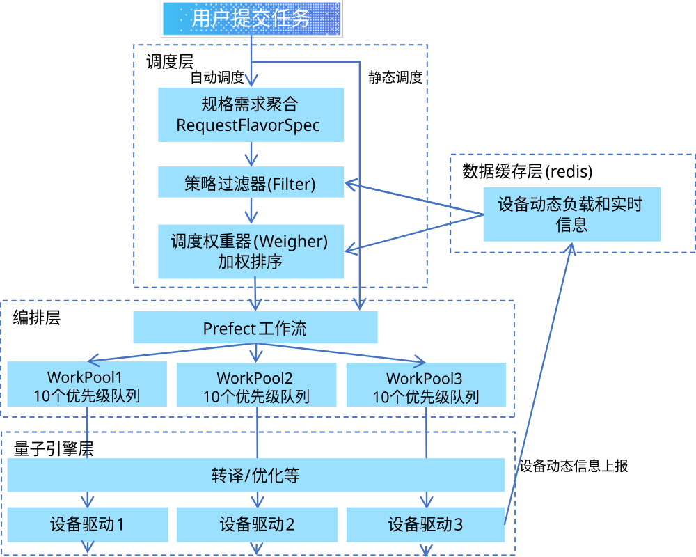

作业自动调度
=================

作业调度是指，用户提交作业时，系统根据用户提交的作业信息和设备的动态信息，选择合适的后端设备，并将作业提交到该设备所关联的deployment/workpool环境中运行。
调度可分为静态调度和自动调度两种方式。

静态调度
--------------------
提交任务时，需要用户指定后端的backend名称，即设备名称，此时任务会直接提交到设备所关联的deployment/workpool环境中运行。

自动调度
--------------------
自动调度是指，用户提交任务时，不指定backend名称，由操作系统自动选择后端设备，并提交任务到该设备所关联的deployment/workpool环境中运行。

自动调度功能依赖于设备动态信息来做调度决策。目前设备动态信息会由每个设备独立的prefect长任务进行定时收集，信息回存在redis数据库中供其它组件读取和使用。

自动调度使用 **Filter Scheduler** 模式，采用两阶段调度：先过滤（Filter），后排序（Weigher）。

自动调度架构图

调度流程
^^^^^^^^^^^^^^^^^^^^

.. plantuml:: ../../_static/design/module-design/auto-scheduler-flow.puml
   :alt: 自动调度流程图
   :width: 80%
   :align: center

1. 构建 ``RequestSpec`` 对象，聚合作业信息、flavor规格和extra_specs
2. 构建 ``DeviceState`` 列表，包含每个设备的静态信息和动态负载信息
3. 依次执行所有启用的 Filter，过滤不符合条件的设备
4. 如果没有设备通过过滤，则直接报错：没有符合条件的设备
5. 如果仅一个设备通过过滤，直接选择该设备
6. 如果多个设备通过过滤，依次执行所有启用的 Weigher，计算权重并排序
7. 选择权重最高的设备作为调度结果

Filter过滤器
^^^^^^^^^^^^^^^^^^^^
Filter 分为必须过滤器和可选过滤器，可选过滤器仅在相关参数指定时启用。

**必须过滤器：**

- ``CodeTypeFilter`` - 匹配设备支持的代码类型CODE_TYPE：QASM、QASM2、QASM3、QUBO等
- ``DeviceStatusFilter`` - 设备的在线状态，必须为在线或繁忙
- ``QueueLimitFilter`` - 设备队列是否已满
- ``DeviceGroupFilter`` - 过滤指定设备组

**可选过滤器（由 flavor_specs / extra_specs 触发）：**

- ``QubitCountFilter`` - 输入的量子比特数满足后端设备要求
- ``TechTypeFilter`` - 设备技术类型匹配（来自 flavor.specs.tech_type）
- ``GateFidelityFilter`` - 单、双比特门保真度满足阈值（来自 flavor.specs.gate_fidelity_Xq_min）
- ``DeviceAvailabilityFilter`` - 设备可用率满足阈值（来自 ``qc:device_availability``）
- ``DeviceNameFilter`` - 设备名白名单/黑名单（来自 ``qcos:devices`` / ``qcos:exclude_devices``）
- ``CodeTypeFilter``（覆盖模式）- 当 ``qcos:code_types`` 指定时，覆盖 job 的 code_type

Weigher权重器
^^^^^^^^^^^^^^^^^^^^
Weigher 通过加权求和对设备进行排序，权重越高越优先选择。

- ``DeviceLoadWeigher`` - 设备繁忙度、排队情况，设备越空闲权重越高
- ``AvgExecTimeWeigher`` - 历史任务(每QBIT)的平均执行时间，执行时间越短权重越高
- ``DeviceAvailabilityWeigher`` - 设备可用率，可用率越高权重越高。
  权重公式： ``0.1 * availability_hourly + availability_total``

设备可用率统计
^^^^^^^^^^^^^^^^^^^^
设备可用率通过 ``DeviceAvailabilityCollector`` 实时采集：

- 后台线程 psubscribe Redis 设备运行信息频道
- 按设备累计 online_count/total_count
- ``DeviceAvailabilityScheduler`` 每整点（CronTrigger minute=0）触发聚合任务
- 聚合后落库到 ``device_availability_hourly`` 表，并清空内存计数器
- ``get_device`` 接口返回 ``availability_hourly`` 和 ``availability_total`` （5位小数）

flavor_id与extra_specs
^^^^^^^^^^^^^^^^^^^^^^^^^^^^^^^^^^^^^^^
自动调度会在submit_job中增加2个可选参数: flavor_id和extra_specs。

- ``flavor_id`` 是用户选择的预设的调度策略，定义静态的、硬件的物理规格
- ``extra_specs`` 是用户自定义的调度参数，定义动态的、单次作业特有的运行策略

两者解耦，设计最清晰。extra_specs 中的同名字段会覆盖 flavor.specs 中的值。

最终的用户提交json示例：

.. code-block:: json

   {
     "job_name": "my-job",
     "source_code": ["..."],
     "flavor_id": "00000000-0000-4000-8000-000000000001",
     "extra_specs": {
        "max_qubits": 100
     }
   }

flavor_id 对应的预设调度策略规格示例：

.. code-block:: json

   {
       "id": "00000000-0000-4000-8000-000000000001",
       "name": "q-flavor-superconducting",
       "description": "superconducting quantum computer",
       "is_public": true,
       "specs": {
           "min_qubits": 16,
           "max_qubits": null,
           "tech_type": "superconducting",
           "gate_fidelity_1q_min": 0.994,
           "gate_fidelity_2q_min": 0.995
       }
   }

针对特殊硬件或者动态调度需求，用户可以通过额外的extra_specs来定义一些特定的调度参数，这些参数会被传递到调度器中进行处理。

extra_specs 支持的字段如下：

.. list-table:: extra_specs 支持字段
   :widths: 28 15 57
   :header-rows: 1
   :align: left

   * - 字段 key
     - 类型
     - 说明（覆盖 flavor 同名字段）
   * - ``qc:min_qubits``
     - int
     - 最少比特数
   * - ``qc:max_qubits``
     - int
     - 最多比特数
   * - ``qc:gate_fidelity_1q_min``
     - float
     - 最小单比特门保真度
   * - ``qc:gate_fidelity_2q_min``
     - float
     - 最小双比特门保真度
   * - ``qc:device_groups``
     - str/list
     - 设备组引用（覆盖 flavor 的设备组）
   * - ``qc:device_availability``
     - float(0-1)
     - 最小设备可用率阈值
   * - ``qc:tech_types``
     - str/list
     - 技术类型白名单
   * - ``qcos:code_types``
     - str/list
     - 允许的 code 类型，覆盖 job 的 code_type
   * - ``qcos:devices``
     - str/list
     - 设备名白名单（``all`` 表示不限制）
   * - ``qcos:exclude_devices``
     - str/list
     - 设备名黑名单

Flavor管理
^^^^^^^^^^^^^^^^^^^^
Flavor 通过 API 接口进行管理：

- ``create_flavor`` - 创建 Flavor
- ``get_flavor`` - 获取单个 Flavor
- ``get_flavors`` - 获取 Flavor 列表
- ``delete_flavor`` - 删除 Flavor

Flavor 的 ``extra_properties`` 支持 ``namespace:key=value`` 格式的
键值对，与 ``extra_specs`` 共享同一套 key 体系。提交作业时的
``extra_specs`` 会覆盖 flavor 中同名字段。

配置
^^^^^^^^^^^^^^^^^^^^
在 ``qcos.toml`` 中可通过 ``[SCHEDULER]`` 配置段自定义启用的
Filter 和 Weigher 列表。AutoScheduler 在初始化时会通过
``Library.import_classes`` 动态扫描 ``scheduler/filters`` 和
``scheduler/weighers`` 目录，自动发现所有继承 ``BaseFilter`` /
``BaseWeigher`` 的子类并建立名称→类的映射；
``ENABLED_FILTERS`` / ``ENABLED_WEIGHERS`` 中的名称须与这些被
发现的类名一致；未识别的名称会被跳过并告警，若全部未识别则回退
到默认列表（``DEFAULT_FILTERS`` / ``DEFAULT_WEIGHERS``）。
``DeviceGroupFilter`` 已在 ``DEFAULT_FILTERS`` 中，其
``device_group_manager`` 由 ``BaseFilterHandler`` 在实例化后
统一通过 ``set_device_group_manager()`` 注入，无需特殊处理。

.. code-block:: toml

   [SCHEDULER]
   # enable auto scheduling (select device automatically when
   # backend is not specified in submit_job)
   ENABLE_AUTO_SCHEDULE = true

   # enabled filter class names; empty list uses all DEFAULT_FILTERS
   # available filters: CodeTypeFilter, DeviceStatusFilter,
   #   QubitCountFilter, TechTypeFilter, GateFidelityFilter,
   #   QueueLimitFilter, DeviceAvailabilityFilter, DeviceNameFilter,
   #   DeviceGroupFilter
   ENABLED_FILTERS = [
       "CodeTypeFilter",
       "DeviceStatusFilter",
       "TechTypeFilter",
       "QubitCountFilter",
       "QueueLimitFilter",
       "GateFidelityFilter",
       "DeviceAvailabilityFilter",
       "DeviceNameFilter",
       "DeviceGroupFilter",
   ]

   # enabled weigher class names; empty list uses DEFAULT_WEIGHERS
   # available weighers: DeviceLoadWeigher, AvgExecTimeWeigher,
   #   DeviceAvailabilityWeigher
   ENABLED_WEIGHERS = [
       "DeviceLoadWeigher",
       "AvgExecTimeWeigher",
       "DeviceAvailabilityWeigher",
   ]
