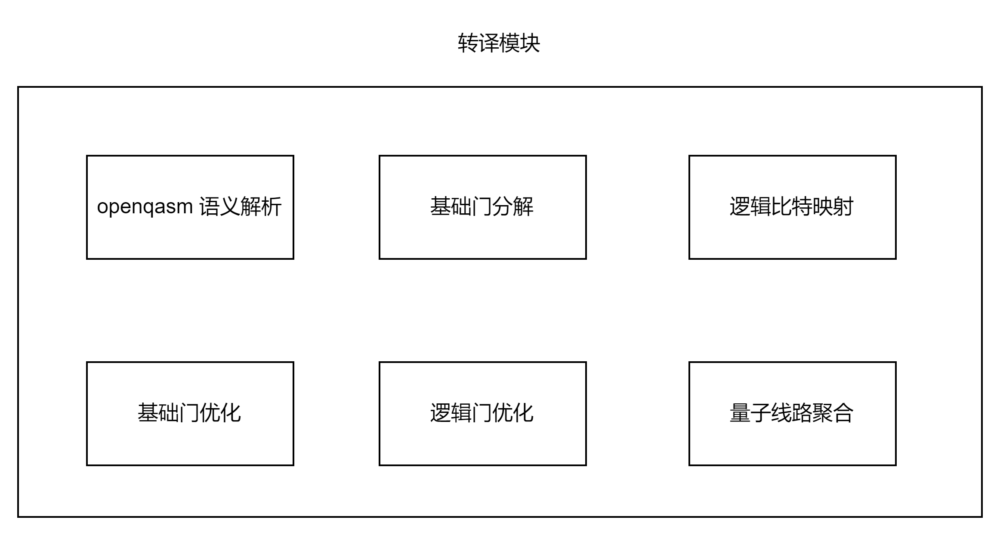
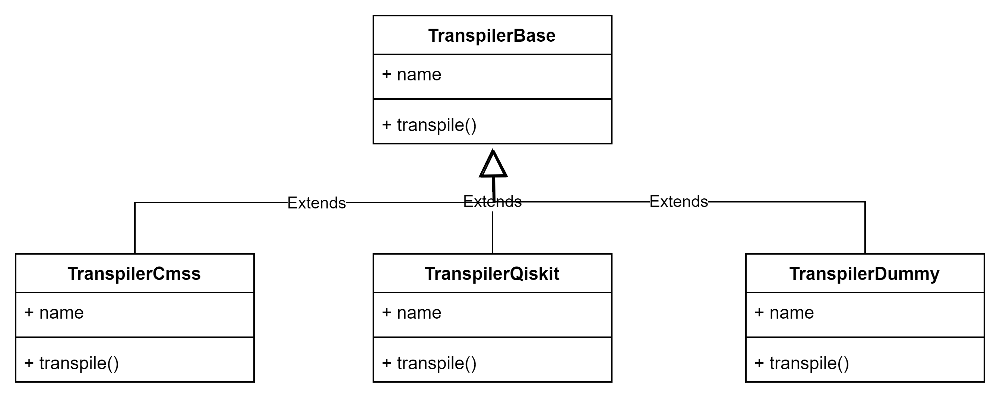
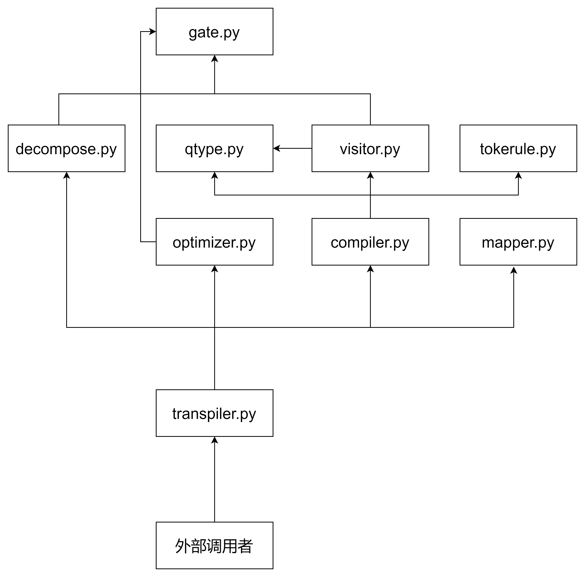

转译器管理和转译器
==================

本模块的功能是将传入的openqasm指令转义成底层硬件支持的基础门列表。

   转译器模块架构图

插件式转译器
--------------------
本模块内置三个转译器插件：五岳量子转译器、Qiskit转译器和Dummy转译器。并且本模块可扩展性较好，支持用户在提交作业时, 动态配置转译器。

   插件式转译器类关系图

五岳转译器
--------------------
如下图所示，模块的入口为transpiler.py。整个模块由3个子功能组成：

   五岳转译器调用关系图

- compiler: 负责将传入的openqasm指令转换成硬件支持的基础门。
- mapper: 负责逻辑量子比特和物理量子比特的映射。
- optimizer: 负责对量子线路和量子门的优化。

本模块提供一个基础的门定义的文件：gate.py，这个文件提供了量子门的定义。

复杂量子门分解
****************
由于openqasm 中定义了数十种量子门，如X，Y, Z, RX, RY, RZ, H, CNOT, S, SDG等等。但是底层量子真机往往只支持两种单量子门和一种双量子门，因此需要将复杂量子门分解为底层真机支持的基础门。

量子门优化
****************
此功能可以对复杂量子门和基础量子门进行优化。优化策略主要包含如下几个：

- 连续的两个作用在相同比特上的厄米共轭门可以消除
- 连续两个相同的选择门，可以合并旋转角
- 旋转角->0的门等同于I，对量子态无影响，可以忽略
- 连续三个量子门HZH 可以优化为X门
- 连续三个量子门HXH 可以优化为Z 门
- 连续三个量子门XRy(θ)X 可以优化为-Ry(θ)门
- 如果末尾的两个门是作用在同一比特上的s和sdg或者t和tdg，则可以消去

量子编译优化
****************
在超大规模量子线路任务的执行过程中，量子线路编译耗时已经大于量子线路在真机上的执行时间。因此有必要对量子线路进行优化，缩短编译耗时，提升任务执行效率。在本系统中，设计了两种编译优化方法。

- 分级优化。预计分成三个等级进行优化，分别是不优化、轻度优化、重度优化。量子门线路可以根据线路特点选择优化策略，从而达到最佳优化效果。
- C++/Rust替代。由于python是解释型语言，因此同样的代码逻辑，python要比C++耗时。因此预计将耗时较长的痛点逻辑(如IR的生成)用C++实现，达到编译优化的目的。
- PYPY优化。 通过PYPY代替传统的CPython解析器, 进行JIT编译，来提升性能

转译管理器初始化
********************

.. code-block:: text

   # init transpilers
   transpiler_manager = TranspilerManager()
   transpiler_manager.load_transpilers()  # 加载转译器
   transpiler_manager.init_transpilers()  # 初始化转译器

转译器初始化
********************

.. code-block:: python
   
   class TranspilerManager(object):
       """
       Transpiler manager
       """

       def load_transpilers(self):
           """Scan and load transpilers."""
           logger.info("Loading transpilers ...")
           base_module_name = "qcos.transpiler"
           ...

       def init_transpilers(self):
           """
           初始化转译器
           """
           for _, transpiler in self.transpilers.items():
               # 初始化转译器
               tanspiler.init_transpiler()

量子计算机/测控转译器示例
****************************

.. code-block:: python

   class TranspilerCmss(TranspilerBase):
       """Transpiler Class for CMSS."""

       def __init__(
           self,
           optimization_level: int = Constant.DEFAULT_OPTIMIZATION_LEVEL,
           enable_na_move: bool = False,
       ):
           super().__init__()
           self.total_qubits = 0
           self.name = Constant.TRANSPILER_CMSS
           # alias name
           self.alias_name = "五岳转译器"
           # version
           self.version = "0.1"
           # supported code types
           self.supported_code_types = [
               Constant.CODE_TYPE_QASM,
               Constant.CODE_TYPE_QASM2,
           ]
           # transpiler_options
           if (
               optimization_level < Constant.MIN_OPTIMIZATION_LEVEL
               or optimization_level > Constant.MAX_OPTIMIZATION_LEVEL
           ):
               raise TranspilerException(
                   f"""
                   optimization_level should be between
                   {Constant.MIN_OPTIMIZATION_LEVEL} and
                   {Constant.MAX_OPTIMIZATION_LEVEL}
                   """
               )
           self.transpiler_options = {
               # default optimization level
               "optimization_level": optimization_level,
               "enable_na_move": enable_na_move,
           }
           # transpiler_options schema used in submit-job from user
           self.transpiler_options_schema = {
               Optional("optimization_level"): int,
               Optional("enable_na_move"): bool,
           }
           # qpu_config
           self.qpu_config = None

       def init_transpiler(self):
           """Init transpiler."""

       def mapping(self, qpu_cfg, opt_result_dict):
           """Mapping.

           Args:
             qpu_cfg: qpu_cfg
             opt_result_dict: opt_result_dict
           :return mapping result dict
           """
           factory = MappingFactory()

           enable_na_move = self.transpiler_options.get("enable_na_move", False)
           mapper = factory.get_mapper_by_type(
               trans_cfg_inst.get_tech_type(), enable_na_move
           )
           mapping_dict = {}
           if len(opt_result_dict) == 1:
               key, value = list(opt_result_dict.items())[0]
               mapping_dict[key] = value[0]
               mapper.prepare_data(value[0], value[1], qpu_cfg)
               mapping_res = mapper.execute_with_order()
               logger.info(f"after mapping: {mapping_res}")
               return mapping_res, mapping_dict
           else:
               ht = HierarchyTree(qpu_cfg)
               ht.construct()
               mapping_res = []
               for key, value in opt_result_dict.items():
                   # 不使用b+树进行block查找
                   blk = get_block(ht, value[0])
                   # 使用b+树进行block查找
                   # TODO (wangjujun): use b+ tree by parameter.
                   # blk = get_block_bplus(ht, value[0])
                   if blk is None:
                       # TODO (xudong): need to remove the task item.
                       self.total_qubits -= value[0]
                       continue
                   mapping_dict[key] = value[0]
                   if not isinstance(mapper, SCRoute):
                       qpu_cfg["operate_area"] = blk
                       qpu_cfg["storage_area"] = [
                           qpu_cfg["closest"][o] for o in blk
                       ]
                   mapper.prepare_data(value[0], value[1], qpu_cfg)
                   mapping_res += mapper.execute_with_order()
               return mapping_res, mapping_dict

       def parse(self, src_code_dict):
           """Parse src_code_dict.

           Args:
             src_code_dict: src_code_dict
           :return parse result
           """
           # compile
           parse_result_dict = {}
           self.total_qubits = 0
           if isinstance(src_code_dict, dict):
               for key, value in src_code_dict.items():
                   logger.info(f"source_code:\n{value}")
                   num_qubits, parse_result = compile(value)
                   if self.total_qubits + num_qubits > trans_cfg_inst.max_qubits:
                       # TODO (xudong): need to remove the remained task item.
                       break
                   self.total_qubits += num_qubits
                   parse_result_dict[key] = (num_qubits, parse_result)
               return parse_result_dict
           else:
               raise TranspilerException("unsupported input")

       def transpile(self, parse_result, supp_basis_gates: list):
           """CMSS transpiler function.

           Args:
             parse_result: parse result
             supp_basis_gates: supported basis gates

           Returns:
               basis gate list(list): basis gate list by cmss transpiler
               mapping_dict(dict): mapping dict by cmss mapping.
               only for neutral atom now
           """
           qpu_cfg = trans_cfg_inst.get_qpu_cfg()
           if not qpu_cfg:
               err_msg = "Missing qpu configs"
               logger.error(err_msg)
               raise ValueError(err_msg)

           opt_result_dict = {}
           opt_level = self.transpiler_options.get(
               "optimization_level", Constant.DEFAULT_OPTIMIZATION_LEVEL
           )
           for key, value in parse_result.items():
               opt_result = optimize_gate(value[1], opt_level)
               opt_result_dict[key] = (value[0], opt_result)

           mapping_res, mapping_dict = self.mapping(qpu_cfg, opt_result_dict)

           # decompose gates
           enable_na_move = self.transpiler_options.get("enable_na_move", False)

           # support cz gate for NARoute
           if enable_na_move:
               supp_basis_gates = [
                   Constant.SINGLE_QUBIT_GATE_RX,
                   Constant.SINGLE_QUBIT_GATE_RY,
                   Constant.TWO_QUBIT_GATE_CZ,
               ]
           parsed_circuit = decompose_gates(mapping_res, supp_basis_gates)

           # optimize circuit
           basis_gate_list = optimize_gate(parsed_circuit, opt_level)
           logger.debug(f"final basis_gate_list: {basis_gate_list}")
           return basis_gate_list, mapping_dict
