代码开发流程
==========================

本章节介绍了 QCOS 项目的代码开发流程、协作规范和提交要求。

.. contents:: 目录
   :local:
   :depth: 3

提交 Issue
------------------------------

在开始开发前，请先在Gitee的WUYUEQbit QCOS官方仓库网页上创建一个 Issue，说明本次提交的类型：

* **需求**：用于跟踪未来希望实现的新功能，本次暂不提交代码，仅提出需求
* **任务**：对应一个新功能（new feature），需要通过提交新代码来实现
* **缺陷**：对应一个新缺陷（bug），需要通过提交 bugfix 代码来修复

填写标题（简短概括）和内容（尽量详细描述），然后点击创建。

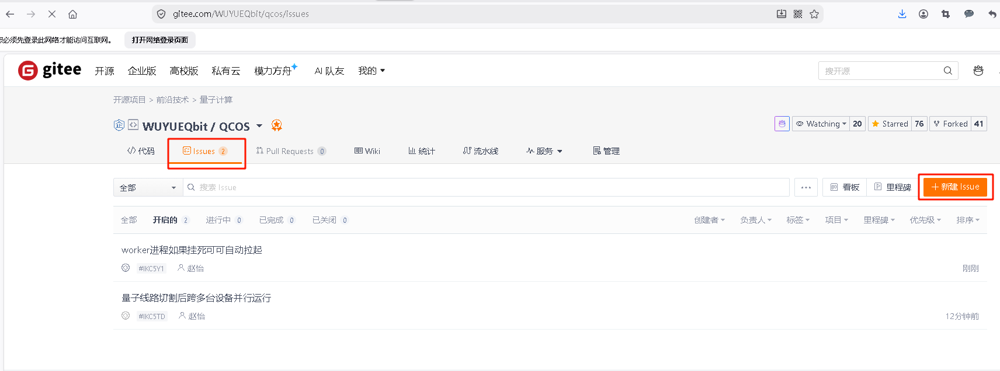

   新建 Issue 步骤一

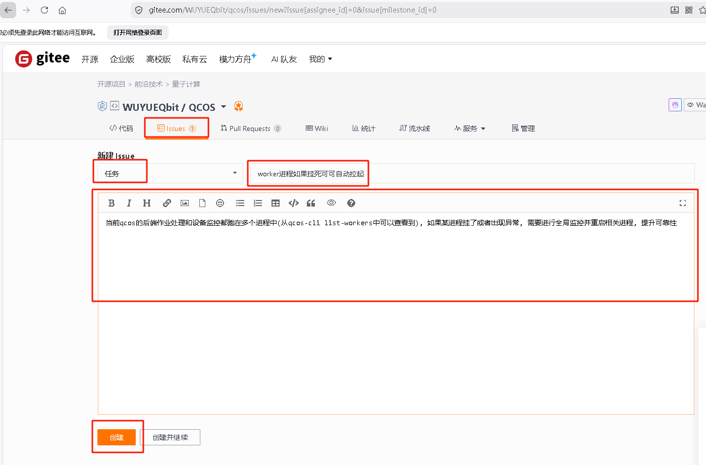

   新建 Issue 步骤二

同步 Fork 的代码
------------------------------

在开发者自己 Fork 的代码仓库名称旁边，点击更新按钮同步代码，保证代码与上游仓库一致。

.. note::

    每次提交代码前，均需保证开发者侧的代码是最新的，否则可能会导致代码冲突或无法合并。

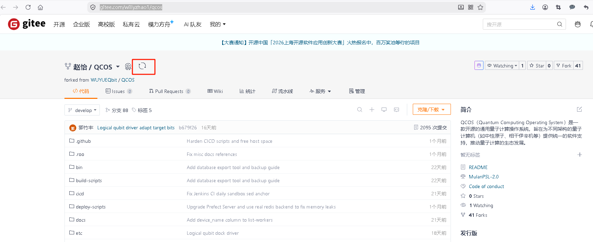

   同步 QCOS 代码 步骤一

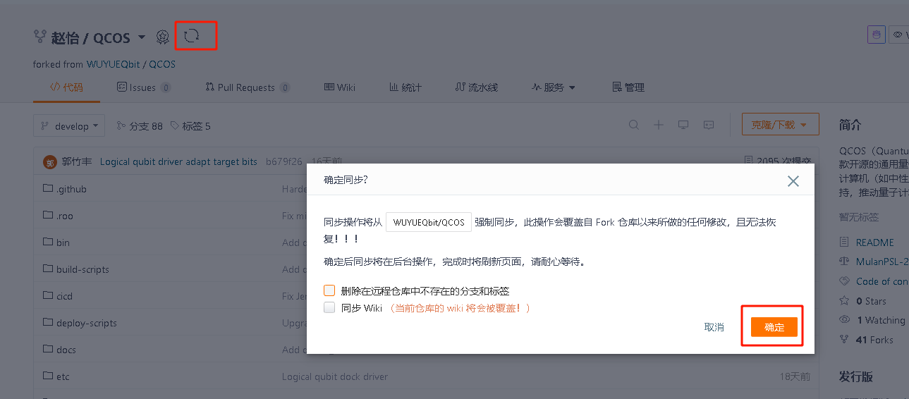

   同步 QCOS 代码 步骤二

代码开发和提交
------------------------------

新功能开发（new feature）或修复问题（bug fix）的流程如下：

.. code-block:: shell

    # 切换到 develop 分支并拉取最新代码
    $ git checkout develop
    $ git pull --rebase

    # 创建新功能分支（格式: feature_新功能缩写，或使用 Gitee Issue ID: feature_IKC5TD）
    $ git branch -m feature_new_author
    或者
    $ git branch -m feature_IKC5TD

    # 或者创建问题修复分支（格式: bugfix_问题缩写，或使用 Gitee Issue ID: bugfix_IKC5TD）
    $ git branch -m bugfix_new_author
    或者
    $ git branch -m bugfix_IKC5TD

.. note::

    具体项目开发规范，参考： :doc:`项目开发规范 <developer-guidelines>` 和 :doc:`新功能模块开发 <develop-new-module>`，
    也可以在AI编程Agent中把下列SKILL作为技能库引用： :download:`SKILL.md <../../../../.roo/skills/develop-new-module/SKILL.md>`

修改代码：

.. code-block:: shell

    $ vim ./AUTHORS

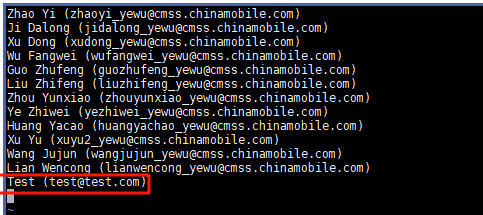

   代码开发示例：文件修改

提交代码：

.. code-block:: shell

    $ git add AUTHORS
    $ git commit

添加提交信息时，要求如下格式：

1. **第一行**：本次提交的摘要（summary）
2. **空一行**
3. **第三行起**：Description 段落，按照 1、2、3 分点描述本次提交的主要修改内容

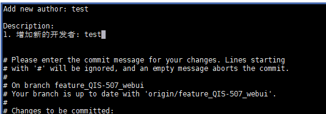

   代码开发示例：添加 commit 信息

代码提交前自检
------------------------------

代码提交前，务必在本地先执行自动化检查脚本，保证代码符合项目规范。

.. code-block:: shell

    # 在 qcos-sandbox 容器内执行以下命令
    ./cicd/run-cicd.sh

.. note::

    具体测试执行细节、测试种类等内容，可以参考： :doc:`测试和 CI/CD <run-tests>`

代码推送流程示例
------------------------------

推送代码提交到远程仓库：

.. code-block:: shell

    $ git push origin feature_new_author

推送成功后，gitee页面上会多出刚才推送的分支：feature_new_author，以及提交信息

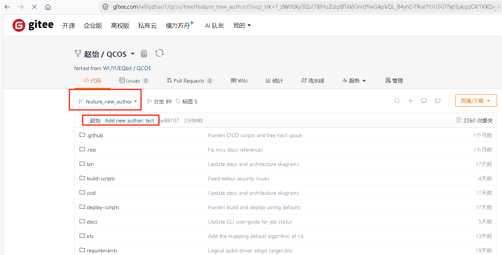

   成功推送代码

在 Gitee 上点击 **Pull Requests (PR)** 并创建：

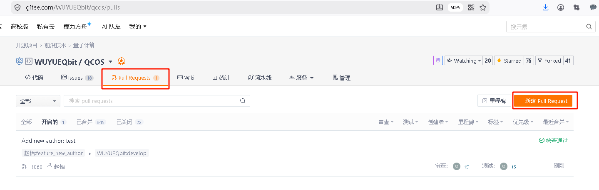

   创建 Pull Request

填写 Pull Request 信息，包括：

* **源分支**：开发者刚刚提交的代码仓库和分支名
* **目标分支**：QCOS 官方仓库 ``WUYUEQbit/qcos``，分支 ``develop``
* **PR 标题**：简要描述本次变更
* **PR 描述**：分点描述变更内容
* **关联 Issue**：关联对应的 Gitee Issue
* **合并选项**：勾选"合并后删除提交分支"和"合并后关闭提到的 Issue"

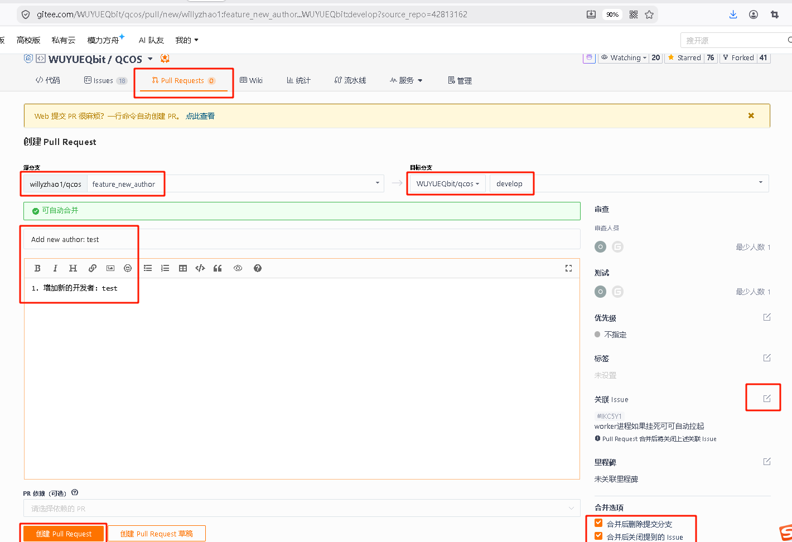

   填写 Pull Request 详细信息

代码评审
------------------------------

提交 PR 后，CI/CD 自动化测试和评审人员会对代码进行评审。

.. rubric:: 评审流程包含两个部分：

1. **CICD 自动测试**：由 Jenkins CI/CD Gate 流水线自动执行（详见 :ref:`CICD自动测试评审 <cicd-auto-test-review>` 段落），通过后 PR 测试状态设为通过
2. **人工代码评审**：至少 **1 名核心开发者** 审批通过后才能合并

.. note::

    代码合并需同时满足两个条件：CI/CD 测试通过 **且** 至少 1 名核心开发者审批通过。

如果评审时发现问题，可以在 Pull Request 中进行代码评审，添加评审意见：

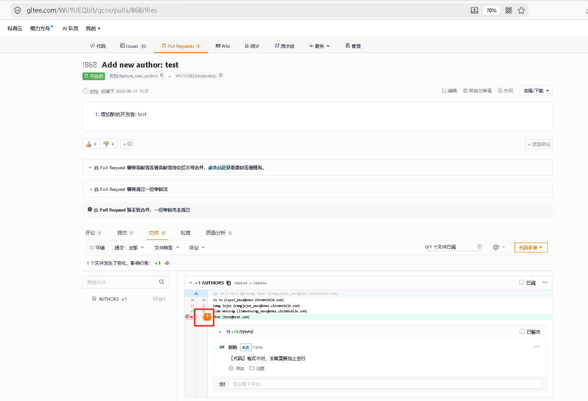

   添加 Code Review 评审意见

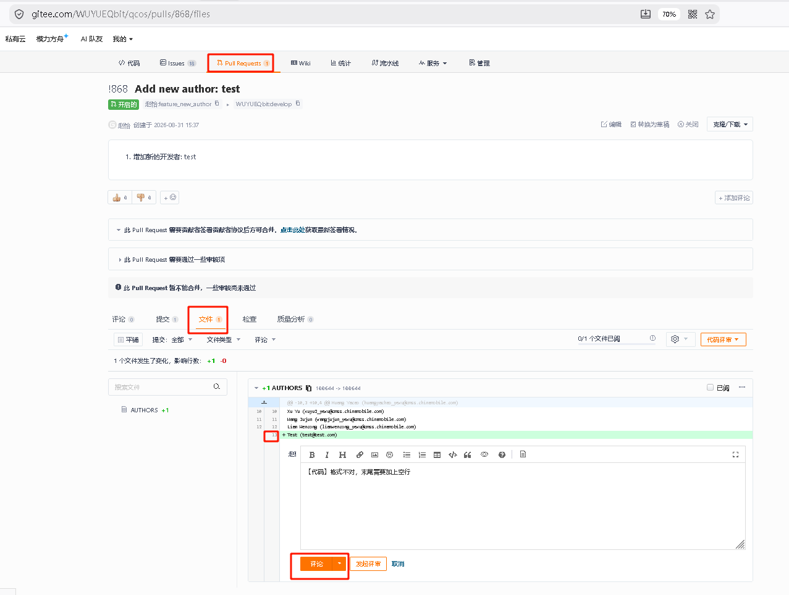

   填写 Code Review 评审意见

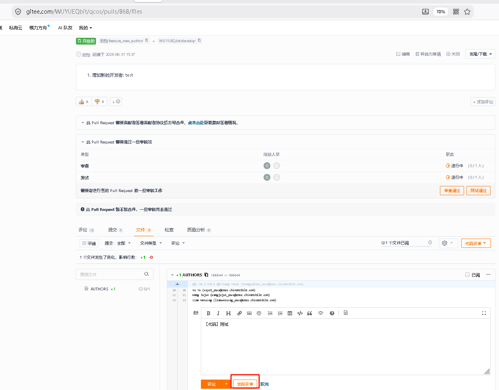

   提交 Code Review 评审意见

开发者查看 Gitee 上的 PR，当有人提出评审建议时，如果有争议或需要讨论，可以在下方评论区发表评论：

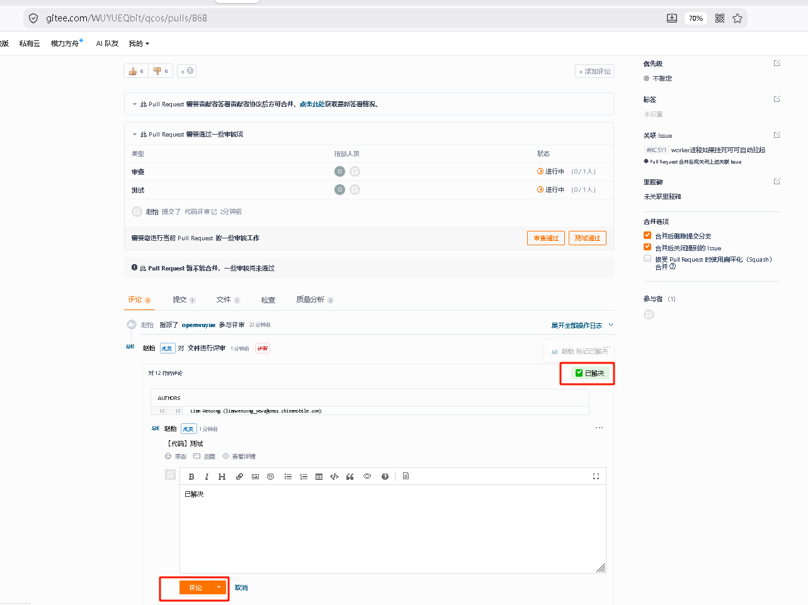

   对 Code Review 意见进行讨论

如果没有争议，则重新修改代码后，强制推送更新，并把评论区意见置为 **已解决** 状态：

.. code-block:: shell

    $ vim AUTHORS
    $ git add AUTHORS
    $ git commit --amend --no-edit
    $ git push -f origin feature_new_author

.. _cicd-auto-test-review:

CICD自动测试评审
------------------------------

开发者提交PR后，Gitee Webhook 会自动触发Jenkins CI/CD Gate 流水线，对本次PR进行自动化测试和代码检查。

.. rubric:: CI/CD 流水线阶段

流水线按以下顺序依次执行，任一阶段失败即终止后续流程：

1. **commit-check**：检查 commit message 格式和文件格式规范
2. **code-check**：代码静态检查（Linter）、代码风格（Code Style）、Docstring 检查
3. **docs-check**：文档规范检查
4. **functional-tests**：C++ 单元测试、Python 代码覆盖率测试、客户端测试

.. rubric:: PR 评审交互

CI/CD 流水线在执行过程中会自动与 Gitee PR 进行交互反馈：

* 构建开始时：自动在 PR 评论区发布"🔄 CI/CD Pipeline Started"评论，附Jenkins构建链接
* 构建成功后：自动在 PR 评论区发布"✅ CI/CD Pipeline Succeeded"评论，并通过Gitee API将PR测试状态设为通过，准许合并
* 构建失败后：自动在 PR 评论区发布"❌ CI/CD Pipeline Failed"评论，附失败日志链接，并通过Gitee API将PR测试状态设为失败（撤销之前的通过状态），阻止合并
* 构建不稳定时：自动发布"⚠️ CI/CD Pipeline Unstable"评论
* 构建中断时：自动发布"🚫 CI/CD Pipeline Aborted"评论

.. note::

    PR 测试状态是合并的前置条件。只有 CI/CD 测试通过（PR 审核页"测试"列显示绿色通过），核心开发者才能执行合并操作。
    若 CI/CD 测试不通过（"测试"列显示红色失败），需重新修改代码后再次提交，测试状态会自动更新。

.. rubric:: 排查 CICD 问题

如果CI/CD测试不通过，可以点击Gitee PR评论区中的CICD报错日志链接，进入Jenkins构建页面排查问题原因。

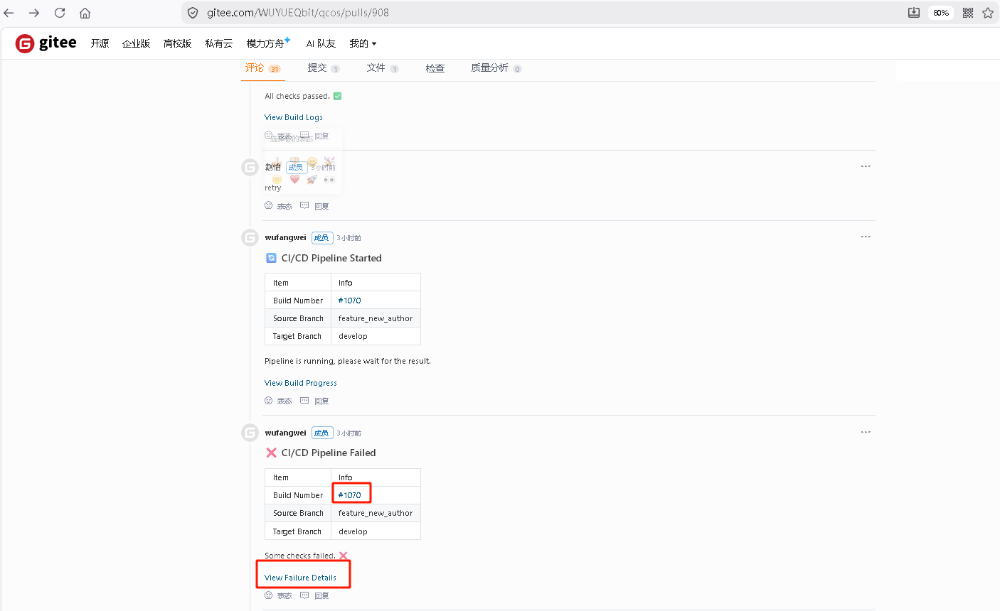

   Gitee PR评论区CICD报错日志链接

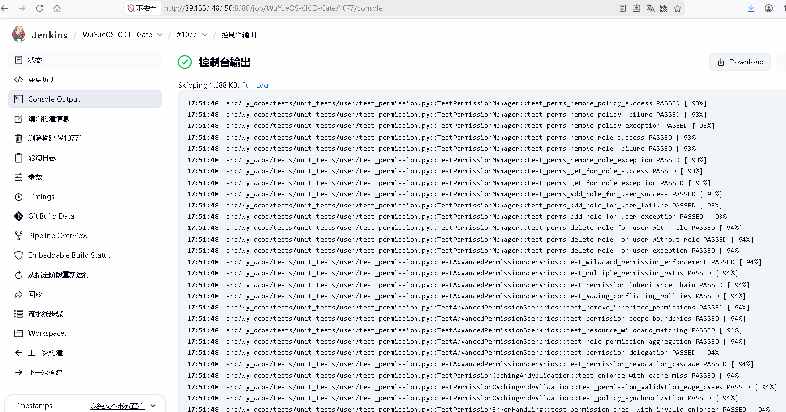

   CICD日志界面排查问题

.. rubric:: 重新触发CICD测试

有时候可能当时CICD环境有问题或其他非代码问题，导致测试没通过。这种情况下开发者可以让CICD重新跑一下，在PR评论区输入以下任一关键词：

* ``retest``
* ``retry``
* ``rebuild``

Jenkins 会接收到评论 Webhook 并重新运行 CI/CD 测试。

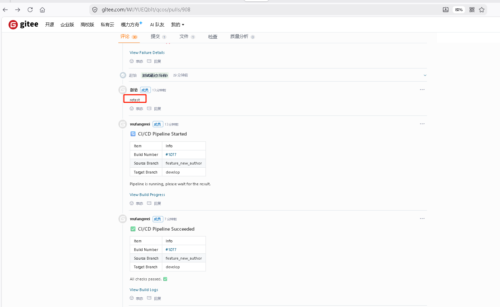

   通过retest / rebuild / retry 重新运行CICD测试

代码合入
------------------------------

当CI/CD测试通过（PR 测试状态显示通过）且至少1名核心开发者审批通过后，
核心开发者将在 Gitee 上手动合并代码，代码合入成功。

合并后，开发者可在本地拉取最新代码：

.. code-block:: shell

    $ git checkout develop
    $ git pull --rebase

.. note::

    合并后如勾选了"合并后删除提交分支"，开发者可删除本地对应的feature/bugfix分支：

    .. code-block:: shell

        $ git branch -d feature_new_author
