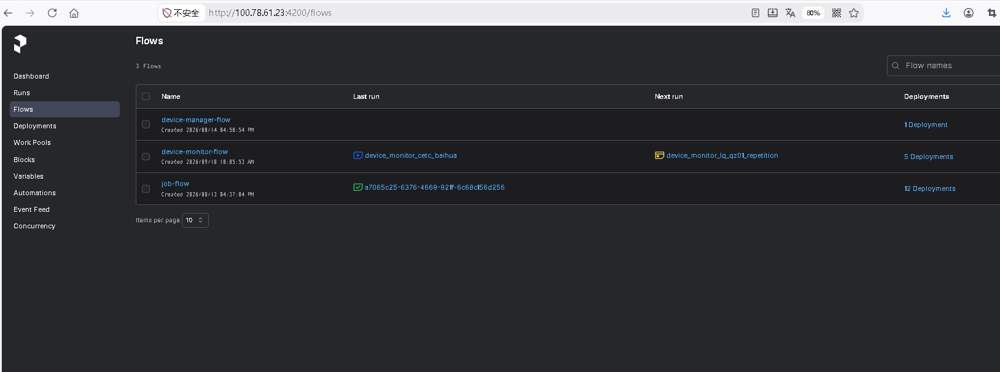
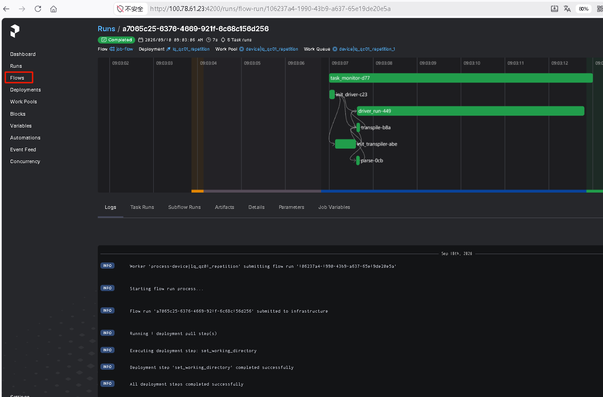
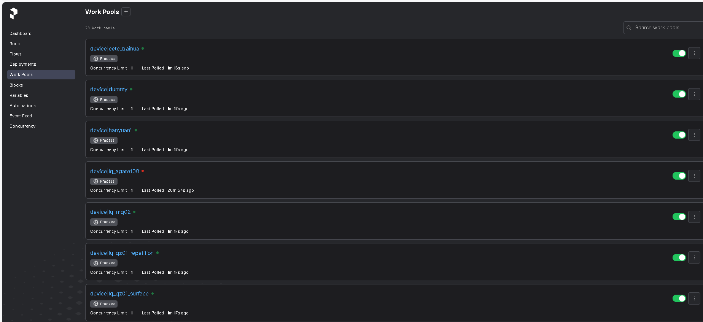
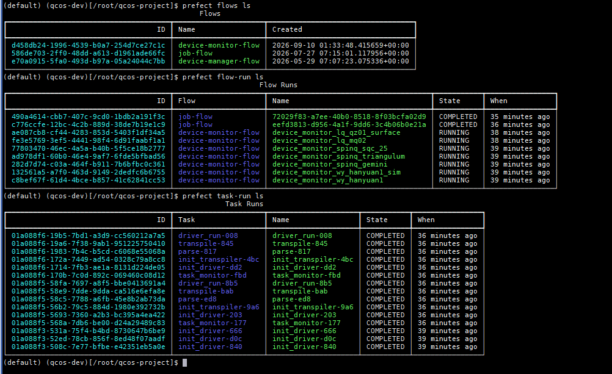

调试指南
=========

本章节介绍 QCOS 操作系统的调试方法，包括容器环境搭建、进程启停和
代码调试技巧。

.. contents:: 目录
   :local:
   :depth: 3

使用 qcos-dev 容器调试
------------------------

为什么使用容器调试
~~~~~~~~~~~~~~~~~~

QCOS 依赖 Redis、PostgreSQL、Prefect Server 、各驱动SDK 等基础组件，本地直接搭建
环境较为复杂。开发人员可以编译出打开DEV模式的``qcos-dev`` 容器镜像，该QCOS容器镜像专门为
开发人员准备，开发者只需挂载本地源代码即可直接修改、启动和调试。

DEV 模式说明
~~~~~~~~~~~~~~~~~~

容器的编译、配置和启动方法详见
:doc:`../user-guide/deploy-guide/build-run-docker`。

在 ``build-scripts/.env`` 中通过 ``DEV`` 变量控制镜像构建模式：

* **DEV=False（生产环境镜像）**：QCOS/QCOS-Client 源代码会编译为
  wheel 软件包并安装到镜像中，启动后使用镜像中安装的 wheel 包运行。
  环境中无法直接修改源代码，如需修改代码必须重新编译镜像。

* **DEV=True（研发环境镜像）**：QCOS/QCOS-Client 源代码不安装到
  镜像中，而是在启动容器时挂载宿主机上开发者的源代码目录。
  使用开发者宿主机上的源代码在容器中运行，可实时修改源代码，
  并在容器中反复重新运行和调试，无需重新编译镜像。

.. note::

   调试和开发时请设置 ``DEV=True``，修改代码后重启 qcos-api 进程
   即可生效。

在容器内重启 qcos-api 进程
------------------------------

正常调试模式
~~~~~~~~~~~~~~~~~~

容器启动时，会自动拉起qcos-api主进程，也可以手动通过下列方式启动 qcos-api：

.. code-block:: shell

    # 在容器内执行
    $ /usr/bin/qcos-api --config-file /etc/qcos/qcos.toml --config-dir /etc/qcos/conf.d/

ST 测试模式
~~~~~~~~~~~~~~~~~~

使用 ST 测试配置启动 qcos-api（加载额外的 ST 配置文件和测试用驱动配置目录）：

.. code-block:: shell

    # 在容器内执行
    $ /usr/bin/qcos-api --config-file /etc/qcos/qcos.toml --config-file /etc/qcos/qcos-st.toml --config-dir /etc/qcos/st-conf.d/

后台运行与前台调试
~~~~~~~~~~~~~~~~~~

.. code-block:: shell

    # 前台运行（日志输出到终端，也会输出到/var/log/qcos/qcos-api.log，方便实时查看）
    $ /usr/bin/qcos-api --config-file /etc/qcos/qcos.toml --config-dir /etc/qcos/conf.d/

    # 后台运行（日志输出到 /var/log/qcos/qcos-api.log）
    $ nohup /usr/bin/qcos-api --config-file /etc/qcos/qcos.toml --config-dir /etc/qcos/conf.d/ > /dev/null 2>&1 &

    # 停止进程
    # 方式1: 在运行终端内按CTRL+C停止 【前台运行场景下】
    # 方式2: 在新的终端内输入pkill -f qcos-api 或者 kill -9 {PID} 【前台/后台运行场景都可以】

调试技巧
---------

主进程（qcos-api）调试
~~~~~~~~~~~~~~~~~~~~~~

qcos-api 主进程是 FastAPI 应用，运行在容器内。调试方法：

**1. 使用 logger 打印日志**

在代码中添加 ``logger.info()`` 或 ``logger.debug()`` 打印调试信息：

.. code-block:: python

    import logging
    logger = logging.getLogger(__name__)

    def my_function():
        logger.info(f"debug: entering my_function, args={args}")
        # ... 业务逻辑

日志输出到 ``/var/log/qcos/api.log`` 或终端（前台模式）。

**2. 使用 pdb 断点调试**

在代码中插入 ``pdb.set_trace()`` 实现交互式断点调试：

.. code-block:: python

    def my_function():
        import pdb; pdb.set_trace()
        # 程序执行到这里会暂停，进入 pdb 交互界面
        # 在终端中可以查看变量、执行表达式、单步执行

注意：使用 pdb 时必须以前台模式启动 qcos-api，才能与 pdb 交互。

**3. 使用 py-spy 查看进程堆栈**

py-spy 已安装，可以 dump 正在运行的进程堆栈：

.. code-block:: shell

    # 查找 qcos-api 主进程 PID
    $ ps aux | grep qcos-api

    # dump 进程堆栈（查看所有线程）
    $ py-spy dump --pid <PID>

    # 实时监控进程（类似 top）
    $ py-spy top --pid <PID>

    # 记录火焰图
    $ py-spy record --pid <PID> --output /tmp/profile.svg

Worker 进程（job-engine / 驱动）调试
~~~~~~~~~~~~~~~~~~~~~~~~~~~~~~~~~~~~~~

Prefect worker 进程中包含量子线路的解析、转译优化、驱动执行等功能，进程会加载并运行在独立的venv环境中，调试方法：

**1. 使用 logger 打印日志**

在 ``job_engine.py`` 或驱动代码中添加日志：

.. code-block:: python

    # job_engine.py 中的任务函数
    @task(persist_result=False)
    def init_driver(...):
        logger.info("init_driver: loading module ...")
        # ... 驱动初始化逻辑

    # driver_quafu.py 中的方法
    def fetch_configs(self):
        logger.info("fetch_configs: calling get_configs()")
        # ... 远程 API 调用

日志输出到驱动的日志文件 ``/var/log/qcos/device_<backend>.log``。

**2. 使用远程 pdb 调试**

Worker 进程在后台运行，无法直接使用标准 pdb。可以使用
rpdb（远程 pdb）进行调试：

.. code-block:: shell

    # 在容器内安装 rpdb
    $ pip install rpdb

在代码中插入远程断点：

.. code-block:: python

    import rpdb
    # 程序执行到这里会暂停，监听 4444 端口等待调试连接
    rpdb.set_trace()

在另一个终端中连接远程调试：

.. code-block:: shell

    # 比如在driver_dummy.py中的def run()函数中加了import rpd; rpd.set_trace()
    # 提交一个作业后端为dummy
    $ qcos-cli submit-job --code-type qasm --shots 10 --backend dummy -f ./samples/qasm/2.0/simple-qasm.qasm
    # 等待执行到断点处
    # 连接远程 pdb（需要知道 worker 进程所在容器的 IP, 本地调试一般可以用127.0.0.1）
    $ telnet <container_ip> 4444
    # 或
    $ nc <container_ip> 4444

**3. 使用 py-spy 查看 worker 进程堆栈**

.. code-block:: shell

    # 查找 worker 进程
    $ ps aux | grep prefect

    # dump worker 进程堆栈
    $ py-spy dump --pid <worker_pid>

**4. 通过 Prefect 查看 flow-run 和 task-run 状态**

Worker 进程中的量子作业执行流程通过 Prefect 的 flow 和 task
组织。可以通过 Prefect WebUI 或 Prefect CLI 查看执行状态，定位卡在哪一步。

**4.1 通过 Prefect WebUI 查看**

Prefect 提供 Web UI 可视化查看作业执行流程。访问地址：

::

    http://<prefect-server-ip>:4200/flows/

WebUI 功能说明：

* **Flows 页面**：查看所有 flow 定义和最近的 flow runs

   Prefect WebUI查看flows

* **Flow Runs 详情页**：点击某个 flow run 可查看：

  - **状态**：Running / Completed / Failed / Crashed
  - **Task Runs**：该 flow 下所有 task 的执行状态和耗时
  - **Logs**：实时查看 task 的日志输出（``logger.info``
    的内容）
  - **Timeline**：可视化查看各 task 的执行时序和依赖关系
  - **Parameters**：flow run 的输入参数（如 job_info）
  - **Artifacts**：flow run 产生的输出结果

   Prefect WebUI查看flow-runs

* **Work Pools 页面**：查看各设备 worker 的在线状态和
  正在处理的 flow run 数量

   Prefect WebUI查看worker pools

**4.2 通过 Prefect CLI 查看**

.. code-block:: shell

    # 查看所有 flows
    $ prefect flows ls

    # 查看所有 flow runs
    $ prefect flow-run ls

    # 查看特定 flow run 的详细信息
    $ prefect flow-run inspect <flow_run_id>

    # 查看所有 task runs
    $ prefect task-run ls

    # 查看特定 task run 的详细信息
    $ prefect task-run inspect <task_run_id>

    # 查看 flow run 的日志
    $ prefect flow-run logs <flow_run_id>

    # Prefect server 日志（在 prefect-server 容器中）
    $ docker logs prefect-server

   Prefect 命令行查看flows/flow-runs/task-runs

**排查 task 卡在 Running 状态（WebUI + CLI + py-spy）：**

1. 在 WebUI 的 Flow Run 详情页中，找到状态为 ``Running``
   且耗时很长的 task（如 ``init_driver-xxx``）
2. 在该 task 的 Logs 标签页中查看是否有日志输出：

   - **有日志**：根据最后一条日志定位卡住的代码位置
   - **无日志**：说明 task 进程可能在远程 API 调用中阻塞

3. 在容器中使用 CLI 获取 task run ID 和 flow run ID：

   .. code-block:: shell

       # 查看 task run 详细信息
       $ prefect task-run inspect <task_run_id>

4. 在容器中查找 flow 执行的子进程 PID：

   .. code-block:: shell

       # 查找 prefect engine 进程（flow 的实际执行进程）
       $ ps aux | grep "prefect.engine"

       # 或查找特定驱动的 venv 进程
       $ ps aux | grep "DriverQuafu"

5. 使用 ``py-spy dump --pid <pid>`` dump 进程堆栈，
   查看卡在哪个函数调用
6. 根据堆栈信息在对应代码位置添加 ``logger.info()`` 或
   ``rpdb`` 断点

常见调试场景
~~~~~~~~~~~~

**作业提交失败排查**

1. 查看 qcos-api 日志：``tail -f /var/log/qcos/api.log``
2. 查看驱动日志：``tail -f /var/log/qcos/device_<backend>.log``
3. 在 ``job.py`` 的 ``submit_job`` 路由中添加 ``logger.info``
   打印设备状态和参数

**设备状态异常排查**

1. 查看 device monitor 日志：``tail -f /var/log/qcos/device_monitor_<backend>.log``
2. 在 ``device.py`` 的 ``set_device_running_info`` 中添加日志
3. 使用 ``py-spy dump`` 查看 monitor 进程堆栈

**调度器选设备异常排查**

1. 在 ``device_state.py`` 的 ``from_device`` 中打印各设备状态
2. 在各 Filter 的 ``filter`` 方法中打印过滤前后的设备列表
3. 在各 Weigher 的 ``weigh`` 方法中打印权重计算结果
