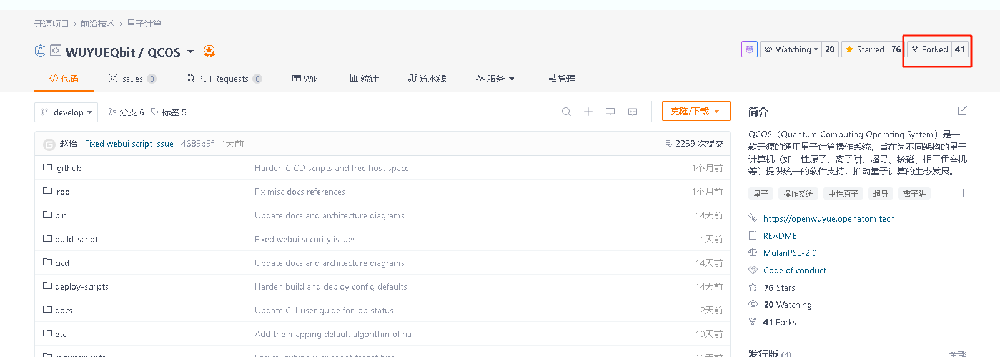
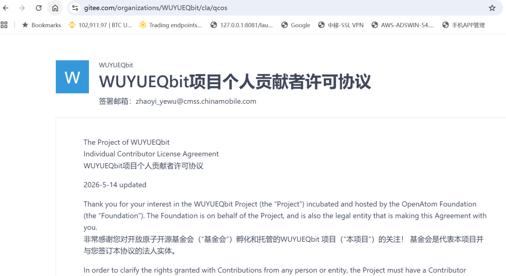
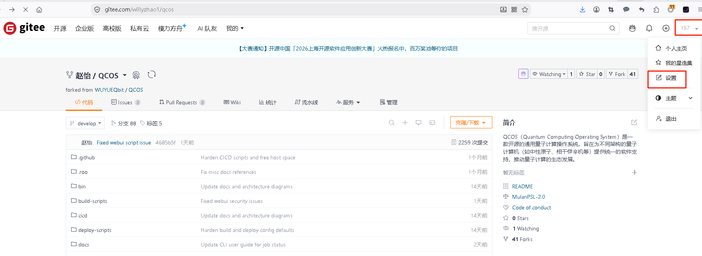
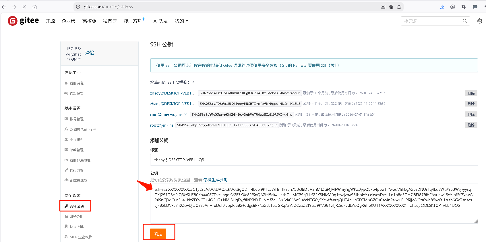

开发环境搭建
===================

本章节介绍 QCOS 项目开发环境的搭建步骤。

.. contents:: 目录
   :local:
   :depth: 3

环境要求清单
------------------------------

* **操作系统**：BCLinux for Euler 21.10、OpenEuler 21/22/23/24、CentOS 7.9 等主流 Linux 操作系统
* **硬件配置**：最低 4 核 CPU / 8G 内存 / 50G 磁盘（开发环境建议配置）
* **网络权限**：需要访问内网镜像源和 Git 仓库地址

软件要求清单
------------------------------

* **版本控制**：Git
* **容器环境**：Docker、Docker Compose
* **Python**：3.11+
* **推荐 IDE**：PyCharm 或 VS Code（含 Python 插件）

Gitee 网站上申请账户并登录
----------------------------------

Gitee 官网：`https://gitee.com <https://gitee.com>`_

Fork QCOS 代码仓库
------------------------------

使用自己的 Gitee 账户登录，进入下列 QCOS 项目网址，点击右上角的 **Fork** 按钮进行仓库拷贝：
`https://gitee.com/WUYUEQbit/qcos <https://gitee.com/WUYUEQbit/qcos>`_

   Fork QCOS 代码仓库

签署贡献者许可协议（CLA）
------------------------------

进入下列项目网址，按照提示进行 CLA 协议签署：
`https://gitee.com/organizations/WUYUEQbit/cla/qcos <https://gitee.com/organizations/WUYUEQbit/cla/qcos>`_

   QCOS CLA 签署页

在 Gitee 上添加开发环境的 SSH 公钥
-----------------------------------

开发环境下获取本地的 SSH 公钥（以 Linux 为例）：

.. code-block:: shell

    $ cat ~/.ssh/id_rsa.pub

.. code-block:: text

    ssh-rsa AAAABBBBBBBBBBBBBBBBBBBBBBBBgQDm4E6bl9RTtUWHnHkYvn753xJBDtl+2nMtZt84jMFWmy
    YgWPZ0ypQ5F54p5u1fYwouVIihEgA35zDNUnfq4EdaWtVY5BWyj/yysqQYj297DBAPiQfXzSUE8CYnaa08ZDkc
    LpgqeV2E7KXe82fSdQAZM9elf4+ashQ+MCP9qR1tf22KBNivM0q1zycjvba98Jht4xY+olweyDze1Ld1b8oSQH
    7l8Ef879iHFAvubw13xYJnf3flZxrwWRXSnGjYdCunSL41NzZE6vCT+4O3LG+NMiBUgPy/8ibESNYTUNmfZqUB
    pJVKCiWo9uxVNTGCySYmAfaVrqQU74dHcGDTMnOZCpCtc4nRaiw+BLRRjjcWGtt6wb89yc6fl1tufh6GxDsnAx
    tLj783EDVxeYn0ZswDjUOYSvAn+roDqf0lebpRfa83+Jdgs8PkNz3BsTbUGRqA7ArZCJiaZ2t9uU9RV381eTjR
    Zid7edEAvQgK6ho9U11Aa/zR/ZZZZZZZZZZZZZZ= root@localhost

如果没有这个文件，可以自己生成：

.. code-block:: shell

    $ ssh-keygen

.. code-block:: text

    Generating public/private rsa key pair.
    Enter file in which to save the key (/root/.ssh/id_rsa): 【回车】
    Enter passphrase (empty for no passphrase): 【回车】
    Enter same passphrase again: 【回车】
    Your identification has been saved in /root/.ssh/id_rsa
    Your public key has been saved in /root/.ssh/id_rsa.pub
    The key fingerprint is:
    SHA256:LT6PFI6wEmV4oYi7rLgnwB2oCUGpNbaMJOpoRlXAM9c root@cne-22
    The key's randomart image is:
    +---[RSA 3072]----+
    |..o.+..          |
    |+++B o E         |
    |B*=oB            |
    |=+o=     .       |
    |O.o o   S .      |
    |** o o + o       |
    |=.. . . =        |
    |+ ..   . +       |
    |++      . .      |
    +----[SHA256]-----+

生成后再次查看公钥内容：

.. code-block:: shell

    $ cat ~/.ssh/id_rsa.pub

.. code-block:: text

    ssh-rsa AAAABBBBBBBBBBBBBBBBBBBBBBBBgQDm4E6bl9RTtUWHnHkYvn753xJBDtl+2nMtZt84jMFWmy
    YgWPZ0ypQ5F54p5u1fYwouVIihEgA35zDNUnfq4EdaWtVY5BWyj/yysqQYj297DBAPiQfXzSUE8CYnaa08ZDkc
    LpgqeV2E7KXe82fSdQAZM9elf4+ashQ+MCP9qR1tf22KBNivM0q1zycjvba98Jht4xY+olweyDze1Ld1b8oSQH
    7l8Ef879iHFAvubw13xYJnf3flZxrwWRXSnGjYdCunSL41NzZE6vCT+4O3LG+NMiBUgPy/8ibESNYTUNmfZqUB
    pJVKCiWo9uxVNTGCySYmAfaVrqQU74dHcGDTMnOZCpCtc4nRaiw+BLRRjjcWGtt6wb89yc6fl1tufh6GxDsnAx
    tLj783EDVxeYn0ZswDjUOYSvAn+roDqf0lebpRfa83+Jdgs8PkNz3BsTbUGRqA7ArZCJiaZ2t9uU9RV381eTjR
    Zid7edEAvQgK6ho9U11Aa/zR/ZZZZZZZZZZZZZZ= root@localhost

在 Gitee 的 **用户设置 → 安全设置 → SSH 公钥** 中，进行公钥的添加：

   Gitee 上添加公钥 步骤一

   Gitee 上添加公钥 步骤二

环境初始化和源码首次同步
----------------------------------

首次初始化并拉取开发者自己 Fork 的仓库和分支（仅首次需要）。

例如，开发者自己 Fork 的仓库为：``git@gitee.com:willyzhao1/qcos.git``

.. code-block:: shell

    # 克隆 Fork 的仓库
    $ git clone git@gitee.com:willyzhao1/qcos.git

    # 配置 Git 用户信息
    $ git config --global user.name '提交者的名字'
    $ git config --global user.email '提交者CLA协议中签署的邮箱'

开发分支源码拉取和同步
----------------------------------

拉取开发者自己 Fork 的开发分支：

.. code-block:: shell

    $ git checkout develop
    $ git pull --rebase
